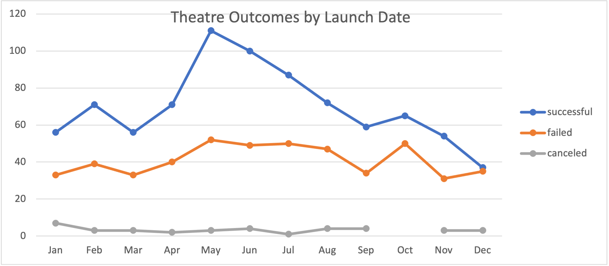

# KICKSTARTER ANALYSIS

## OVERVIEW OF PROJECT
Louise is a playwright hoping to launch a theatre production with a budget of $10 000+. Our job is to make an analysis of other crowdfunding campaigns to help Louise make informed decisions for success. 

## ANALYSIS & CHALLENGES

This analysis was performed on a wide dataset, sorted and organized to ascertain the factors important to achieve a successful fundraising campaign. 
We can see that campaign success is greatly effected by launch date.  

We can also see that fundraising success is also effected by goal.
![

Some challenges and difficulties encountered in this analysis occurred with creating tables and data manipulation. 

## RESULTS 

By analyzing the chart ‘Outcomes based on Goals’ we can determine that Kickstarters with lower fundraising goals had greater success than Kickstarters with goals primarily set in the higher range. 

By examining the chart of 'Theatre Outcomes by Launch Date' we can determine the theatre kickstarters launched in May had better outcomes than Kickstarters launched in the November, December and January. It appears that the cold weather slows down fundraising campaigns. 

Overall, the dataset is limited by lack of data a field, "Theatre runs by weeks and / or months", this information will have allowed Louise to compare her goals with other fundraisers and assist her in determining how long her play could run. This field could have been filtered by country and offered her valuable information. 

The assignment could benefit from tables illustrating "Outcomes based on Campaign duration" so Louise would know how long to run her campaign, this would be filtered by subcategory (play) and country (US). Also, a table demonstrating "Outcomes based on Average Donation" may help Louise plan her campaign fundraising events.
